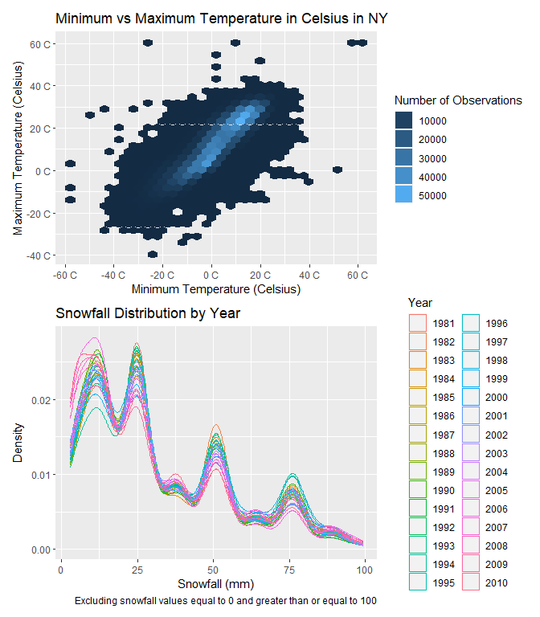

Homework 3
================
Vanessa Dinh
10/12/22

``` r
library(tidyverse)
```

    ## ── Attaching packages ─────────────────────────────────────── tidyverse 1.3.2 ──
    ## ✔ ggplot2 3.3.6     ✔ purrr   0.3.4
    ## ✔ tibble  3.1.8     ✔ dplyr   1.0.9
    ## ✔ tidyr   1.2.0     ✔ stringr 1.4.1
    ## ✔ readr   2.1.2     ✔ forcats 0.5.2
    ## ── Conflicts ────────────────────────────────────────── tidyverse_conflicts() ──
    ## ✖ dplyr::filter() masks stats::filter()
    ## ✖ dplyr::lag()    masks stats::lag()

``` r
library(patchwork)
```

## Problem 1

``` r
library(p8105.datasets)
data("instacart")
```

## Problem 2

``` r
accel = 
  read_csv("./data/accel_data.csv") %>% 
  janitor::clean_names() %>% 
  pivot_longer(
    activity_1:activity_1440,
    names_to = "minute",
    names_prefix = "activity_",
    values_to = "activity_count"
  ) %>% 
  mutate(
    day_type = ifelse(
      day == "Saturday" | day == "Sunday",
      "Weekend", "Weekday"),
    week = as.factor(week),
    day_id = as.factor(day_id),
    day = factor(day, levels = c("Monday", "Tuesday", "Wednesday", "Thursday", "Friday", "Saturday", "Sunday")),
    day_type = as.factor(day_type),
    minute = as.numeric(minute),
    activity_count = as.numeric(activity_count))
```

    ## Rows: 35 Columns: 1443
    ## ── Column specification ────────────────────────────────────────────────────────
    ## Delimiter: ","
    ## chr    (1): day
    ## dbl (1442): week, day_id, activity.1, activity.2, activity.3, activity.4, ac...
    ## 
    ## ℹ Use `spec()` to retrieve the full column specification for this data.
    ## ℹ Specify the column types or set `show_col_types = FALSE` to quiet this message.

``` r
accel
```

    ## # A tibble: 50,400 × 6
    ##    week  day_id day    minute activity_count day_type
    ##    <fct> <fct>  <fct>   <dbl>          <dbl> <fct>   
    ##  1 1     1      Friday      1           88.4 Weekday 
    ##  2 1     1      Friday      2           82.2 Weekday 
    ##  3 1     1      Friday      3           64.4 Weekday 
    ##  4 1     1      Friday      4           70.0 Weekday 
    ##  5 1     1      Friday      5           75.0 Weekday 
    ##  6 1     1      Friday      6           66.3 Weekday 
    ##  7 1     1      Friday      7           53.8 Weekday 
    ##  8 1     1      Friday      8           47.8 Weekday 
    ##  9 1     1      Friday      9           55.5 Weekday 
    ## 10 1     1      Friday     10           43.0 Weekday 
    ## # … with 50,390 more rows

``` r
str(accel)
```

    ## tibble [50,400 × 6] (S3: tbl_df/tbl/data.frame)
    ##  $ week          : Factor w/ 5 levels "1","2","3","4",..: 1 1 1 1 1 1 1 1 1 1 ...
    ##  $ day_id        : Factor w/ 35 levels "1","2","3","4",..: 1 1 1 1 1 1 1 1 1 1 ...
    ##  $ day           : Factor w/ 7 levels "Monday","Tuesday",..: 5 5 5 5 5 5 5 5 5 5 ...
    ##  $ minute        : num [1:50400] 1 2 3 4 5 6 7 8 9 10 ...
    ##  $ activity_count: num [1:50400] 88.4 82.2 64.4 70 75 ...
    ##  $ day_type      : Factor w/ 2 levels "Weekday","Weekend": 1 1 1 1 1 1 1 1 1 1 ...

``` r
# In the accel dataset, there are 4 factor variables: week, day_id, day, and day_type (weekend/weekday variable). 
# There are 2 numeric variables: minute, which depicts one of the 1440 minutes within a day, and activity level.
# There are 50,400 observations and 6 variables.
```

``` r
summary_accel = accel %>%  
  group_by(week, day) %>% 
  summarize(total_activity = sum(activity_count)) %>% 
  pivot_wider(
    names_from = day,
    values_from = total_activity
  ) %>% 
  knitr::kable(digits = 1)
```

    ## `summarise()` has grouped output by 'week'. You can override using the
    ## `.groups` argument.

``` r
summary_accel
```

| week |   Monday |  Tuesday | Wednesday | Thursday |   Friday | Saturday | Sunday |
|:-----|---------:|---------:|----------:|---------:|---------:|---------:|-------:|
| 1    |  78828.1 | 307094.2 |    340115 | 355923.6 | 480542.6 |   376254 | 631105 |
| 2    | 295431.0 | 423245.0 |    440962 | 474048.0 | 568839.0 |   607175 | 422018 |
| 3    | 685910.0 | 381507.0 |    468869 | 371230.0 | 467420.0 |   382928 | 467052 |
| 4    | 409450.0 | 319568.0 |    434460 | 340291.0 | 154049.0 |     1440 | 260617 |
| 5    | 389080.0 | 367824.0 |    445366 | 549658.0 | 620860.0 |     1440 | 138421 |

``` r
# There is less activity on Saturdays. 
# Moreover, Mondays, Fridays, Saturdays, and Sundays have variable activity while Tuesdays, Wednesdays, and Thursdays have similar total activity levels by week. 
# Approximately, there is one day a week of high activity (over 600,000 units of activity).
```

``` r
accel_plot = 
  accel %>% 
  ggplot(aes(x = minute, y = activity_count, group = day_id, color = day)) +
   geom_line(alpha = .5) +
  labs(
    title = "Daily Activity by Minute",
    x = "Minute of the Day",
    y = "Activity Count"
  ) +
  scale_x_continuous(
    breaks = c(0, 250, 500, 750, 1000, 1250, 1500), 
    labels = c("0", "250", "500", "750", "1000", "1250", "1500"))+
  guides(color = guide_legend(title = "Day of the Week")) 

  
accel_plot
```


``` r
# There's less activity between 0 (12:00 AM) and about 300 minutes (5:00 AM) in the day. 
# There are spikes of activity at different points of the day, particularly on Friday at around 1200-1300 minutes (8-10 pm) and 600 minutes (10:00 AM) on Sunday.
```

## Problem 3

``` r
library(p8105.datasets)
data("ny_noaa")

ny_noaa 
```

    ## # A tibble: 2,595,176 × 7
    ##    id          date        prcp  snow  snwd tmax  tmin 
    ##    <chr>       <date>     <int> <int> <int> <chr> <chr>
    ##  1 US1NYAB0001 2007-11-01    NA    NA    NA <NA>  <NA> 
    ##  2 US1NYAB0001 2007-11-02    NA    NA    NA <NA>  <NA> 
    ##  3 US1NYAB0001 2007-11-03    NA    NA    NA <NA>  <NA> 
    ##  4 US1NYAB0001 2007-11-04    NA    NA    NA <NA>  <NA> 
    ##  5 US1NYAB0001 2007-11-05    NA    NA    NA <NA>  <NA> 
    ##  6 US1NYAB0001 2007-11-06    NA    NA    NA <NA>  <NA> 
    ##  7 US1NYAB0001 2007-11-07    NA    NA    NA <NA>  <NA> 
    ##  8 US1NYAB0001 2007-11-08    NA    NA    NA <NA>  <NA> 
    ##  9 US1NYAB0001 2007-11-09    NA    NA    NA <NA>  <NA> 
    ## 10 US1NYAB0001 2007-11-10    NA    NA    NA <NA>  <NA> 
    ## # … with 2,595,166 more rows

``` r
ny_noaa %>% 
  summarize_all(~sum(is.na(.))) %>% 
  knitr::kable()
```

|  id | date |   prcp |   snow |   snwd |    tmax |    tmin |
|----:|-----:|-------:|-------:|-------:|--------:|--------:|
|   0 |    0 | 145838 | 381221 | 591786 | 1134358 | 1134420 |

``` r
# The ny_noaa dataset contains 2,595,176 observations and 7 variables. 
# The variables are id (station id), date, prcp (precipitation), snow (amount of snowfall), snwd (snow depth), tmax (maximum temperature), and tmin (minimum temperature). 
# There are over 1 million missing values for tmax and tmin each, just less than 600,000 missing vlaues for snow depth, almost 400,000 missing values for snowfall, and almost 150,000 missing values for precipitation out of the 2.6 million observations.
```

``` r
ny_noaa_tidy = 
  ny_noaa %>% 
  janitor::clean_names() %>% 
  separate(
    date,
    into = c("year", "month", "day"),
    sep = '-') %>% 
  mutate(
    year = as.factor(year),
    month = as.integer(month),
    month = month.name[month],
    month = as.factor(month),
    station = as.factor(id),
    day = as.integer(day),
    prcp = as.numeric(prcp),
    snow = as.numeric(snow),
    snwd = as.numeric(snwd),
    tmax = as.numeric(tmax),
    tmin = as.numeric(tmin),
    prcp = prcp/10,
    tmax= tmax/10,
    tmin = tmin/10
  ) %>% 
  select(-id)

mode = function(v){
  uniqv = unique(v[!is.na(v)])
  uniqv[which.max(table(match(v, uniqv)))]
}

ny_noaa_snow = ny_noaa_tidy %>% 
  summarize(snow_mode = mode(snow))

ny_noaa_snow
```

    ## # A tibble: 1 × 1
    ##   snow_mode
    ##       <dbl>
    ## 1         0

``` r
# Zero is the most commonly observed value for snowfall since snowfall is limited to cold temperatures, which are usually in the winter months of December, January, and February. 
# Even within these months, snowfall measurement can be variable and is more likely to be measured on a continuous scale, meaning there are no distinct categories for snowfall measurement to fall into and therefore will not have common values, besides 0.
```

``` r
ny_noaa_plot = 
  ny_noaa_tidy %>% 
  group_by(station, year, month) %>% 
  summarize(mean_tmax = mean(tmax, na.rm = TRUE))
```

    ## `summarise()` has grouped output by 'station', 'year'. You can override using
    ## the `.groups` argument.

``` r
jan_july_plot =
  ny_noaa_plot %>% 
  filter(month == "January" | month == "July") %>% 
  ggplot(aes(x = year, y = mean_tmax, group = station, color = station)) +
  geom_line(alpha = 0.5) +
  facet_grid(~ month) +
  theme(legend.position = "none") +
  labs(
    title = "Average Maximum Temperature in January and July by Year and Station",
    x = "Year",
    y = "Average Maximum Temperature in Celsius",
    caption = "Data from ny_noaa"
  ) +
  scale_x_discrete(
    breaks = c(1981, 1985, 1990, 1995, 2000, 2005, 2010),
    labels = c("1981", "1985", "1990", "1995", "2000", "2005", "2010"),
    guide = guide_axis(angle = 45)
  ) +
  scale_y_continuous(
    breaks = c(-10, 0, 10, 20, 30),
    labels = c("-10 C", "0 C", "10 C", "20 C", "30 C")
  ) +
  viridis::scale_color_viridis(
    discrete = TRUE,
    option = "B"
  ) 

jan_july_plot
```

    ## Warning: Removed 5640 row(s) containing missing values (geom_path).


``` r
# Max temperatures in July are on average around 25 degrees Celsius higher than max temperatures in January, regardless of year. 
# The max temperature seems to oscillate year to year, though it seems to become less variable between stations in the years 2000-2010. 
```

``` r
tmax_tmin_ggplot = 
  ny_noaa_tidy %>% 
  ggplot(aes(x = tmin, y = tmax)) +
  geom_hex() +
  labs(
    title = "Minimum vs Maximum Temperature in Celsius in NY",
    x = "Minimum Temperature (Celsius)",
    y = "Maximum Temperature (Celsius)"
  ) +
  scale_y_continuous(
    breaks = c(-40, -20, 0, 20, 40, 60), 
    labels = c("-40 C", "-20 C", "0 C", "20 C", "40 C", "60 C")) +
  scale_x_continuous(
    breaks = c(-60, -40, -20, 0, 20, 40, 60), 
    labels = c("-60 C", "-40 C", "-20 C", "0 C", "20 C", "40 C", "60 C")) +
  guides(fill = guide_legend(title = "Number of Observations"))
```

``` r
snowfall_plot = 
  ny_noaa_tidy %>% 
  filter(snow > 0 & snow < 100) %>% 
  ggplot(aes(x = snow, group = year, color = year)) +
  geom_density(alpha = 0.5) +
  labs(
    title = "Snowfall Distribution by Year",
    x = "Snowfall (mm)",
    y = "Density",
    caption = "Excluding snowfall values equal to 0 and greater than or equal to 100"
  ) +
  guides(color = guide_legend(title = "Year"))
```

``` r
tmax_tmin_ggplot / snowfall_plot
```

    ## Warning: Removed 1136276 rows containing non-finite values (stat_binhex).



``` r
# The tmax vs tmin hex plot seems to have a positive linear distribution.
# The minimum temperature ranges from around -60 C to 60 C.
# The maximum temperature ranges from around -40 C to 60 C.
# There is a concentration of observations from -20 C to 20 C for minimum temperature and -5 C to 35 C for maximum temperature.
# Snowfall distribution peaks at 12.5 and 50 mm across all years between 1981 and 2010 and seems to decrease as snowfall increases.
# Snowfall density has other peaks at 50 mm and 75 mm, though decreasingly smaller than the peak at 25 mm, respectively.
```
